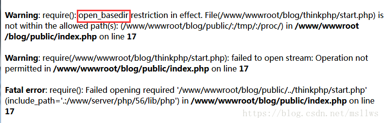

# 关于open_basedir错误的修复 #

----------

 关于该问题，大部分是vhosts虚拟域名配置问题导致。

解决办法：将原open_basedir:`php_admin_value open_basedir /data/www/tests/你的目录`改为：`php_admin_value open_basedir /data/www/tests/` ，即将目录去掉，权限只限定为该根目录即可，Tip：Directory的限定也是如此