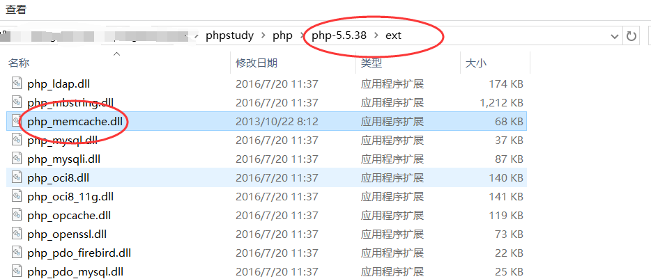

#  Memcache x64集成  #

> 由于开发环境为php5,因此memcache扩展采用php5.5的版本，如果为其他php版本，请 [**在此处**](http://pecl.php.net/package/memcache/3.0.8/windows) 选择对应版本的dll扩展文件

----------

1. 下载[memcache](../res/file/memcached-win64-1.4.4-14.zip)，解压，在本目录管理员cmd输入命令：`E:\memcached\memcached.exe -d install`，`E:\memcached\memcached.exe -d start`，然后在服务里开启memcache服务为：自动启动  
2. 下载php的memcache扩展：[memcache.dll](../res/file/php_memcache-3.0.8-5.5-ts-vc11-x86.zip)，将其放入php/ext目录下 
3. 在php.ini中加入扩展命令：extension=php_memcache.dll 
4. 以上操作完成后，重启Apache